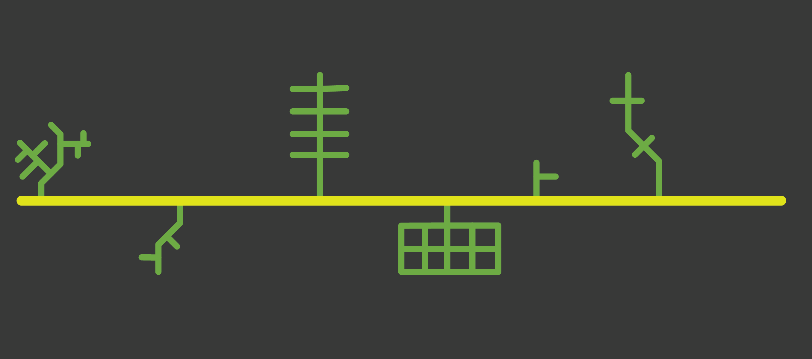
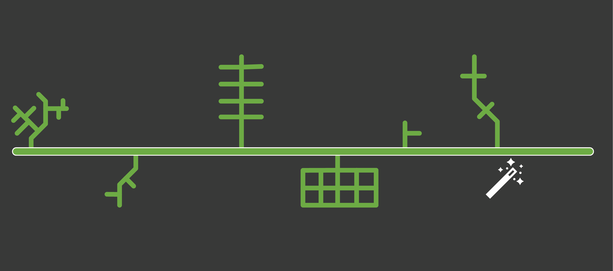
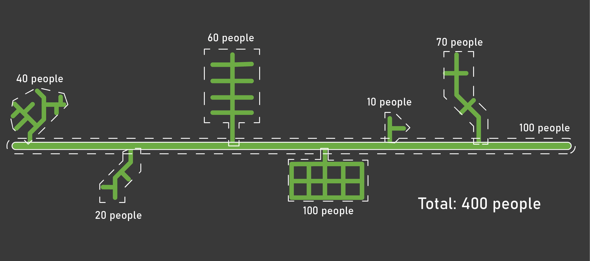
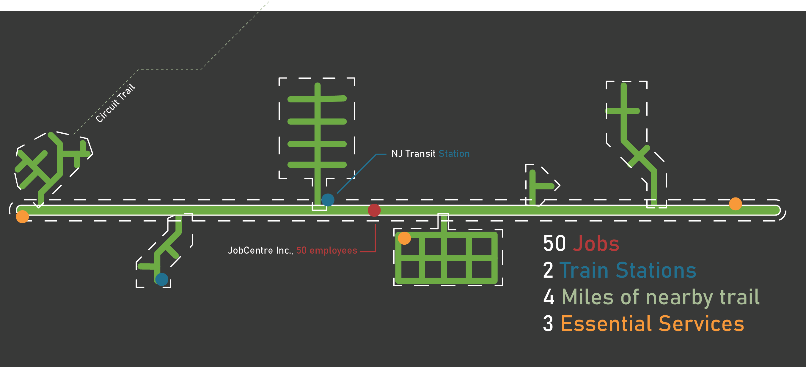

This tool uses the concept of 'islands of connectivity,' the idea that low-stress streets are 'islands,' separated by higher stress roadways. 

Consider the following example. 
The yellow, or relatively high-stress, segment (LTS 3) is an arterial
road with two lanes in each direction. The green, low-stress roads
(LTS 1 or 2) are neighborhood streets and are primarily residential.

Right now, each collection of green streets is an “island” for people
who are only comfortable biking on low stress (LTS 1 or 2) roads or
trails. They would not consider biking on the yellow segment, as it
would feel unsafe or stressful.

But if it was possible to convert the yellow LTS 3 segment into an LTS
1 or 2 segment, by building a safer bicycle facility (whether that be
a protected bike lane, a roadside trail, or some other measure), all
of the neighborhood streets would now be connected via the newly
converted low-stress segment. (This is what you're able to do by drawing segments using this tool.)

          
By pulling census tract information, it is possible to create an
estimate for how many people live in each low stress island. By
totaling the number of people in each island, along with the people
who actually live along the segment, a high level estimate for the
number of people connected via the new segment can be achieved. That
is to say, we can estimate how many people were previously on an
"island," but could now bike to other segments.

We can also estimate the number of jobs, transit stations, essential
services, or nearby trails that could be connected if this segment was
improved.

!!! note 
    You may sometimes see a 'blob' shape that extends beyond the street network. LINK folds in certain land uses (e.g., school parking lots, parks, etc..) 
    in order to more effectively capture proximate uses. So for example, if a school is setback from a high-stress road, LINK will grab both the parking lot and the 
    school land use and include the school as part of what the new segment connects. 