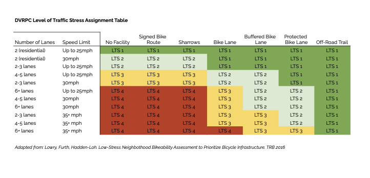

On the bicycle side, Link is based on the Level of Traffic Stresss (LTS). LTS is a road classification scheme based on the estimated comfort of bicyclists in the traffic stream. 

The table below summarizes LTS in terms of the cyclist type that would be comfortable on certain levels and the characteristics of those levels. Generally, as the colors indicate, the higher the LTS, the more dangerous or, the greater the perceived danger, and the more confident the cyclist needs to feel on their bike to consider riding on that type of road. DVRPC’s LTS assignment is based on the number of lanes, effective vehicle speed, and the presence and type of bicycle facility along the road segment. Surveys have shown that the Interested by Concerned group is the largest; therefore, they are often the target audience for bicycle infrastructure planning.

| **Level of Traffic Stress (LTS)** | **Comfortable Enough For** | **Characteristics**                                                              |
|:---------------------------------:|:--------------------------:|:--------------------------------------------------------------------------------:|
| 1                                 | Most People                | Lowest stress, comfortable for most ages and abilities                           |
| 2                                 | Interested, but Concerned  | Suitable for most adults; presents little traffic stress                         |
| 3                                 | Enthused and Confident     | Moderate traffic stress; comfortable for those already biking in American cities |
| 4                                 | Strong and Fearless        | High traffic stress; multilane, fast-moving traffic                              |

LTS is assigned based on facility type, number of lanes, and speed limit. You can see the LTS assignment table below. 

LINK _assumes_ that any improvements you draw on an LTS 3 or 4 road represent a facility that, if built, would reduce the stress level to a 1 or a 2. So while you might be able to draw a segment on an LTS 4 road and get some information about its connectivity benefit, 
if you are planning that segment to be sharrows or an unprotected bike lane, you are not actually reducing the stress level, and therefore not actually making the connection any safer or more viable for all users. 

In short, the onus is on you as a facility designer to design the safest and least stressful study that you can. 
