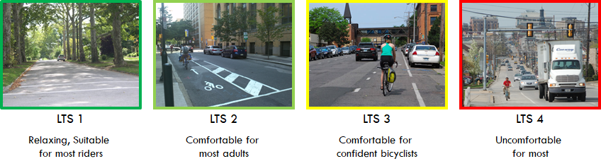

On the bicycle side, LINK uses the Level of Traffic Stress (LTS) network. LTS is a road classification scheme based on the estimated comfort of bicyclists in the traffic stream. 

Source: NJDOT Technology Transfer, 2021

The table below summarizes LTS in terms of the cyclist type that would be comfortable on certain levels and the characteristics of those levels. 
Generally, the higher the LTS, the more dangerous or the greater the perceived danger, and the more confident the cyclist needs to feel on their bike to consider riding on that type of road. 

| **Level of Traffic Stress (LTS)** | **Comfortable Enough For** | **Characteristics**                                                              |
|:---------------------------------:|:--------------------------:|:--------------------------------------------------------------------------------:|
| 1                                 | Most People                | Lowest stress, comfortable for most ages and abilities                           |
| 2                                 | Interested, but Concerned  | Suitable for most adults; presents little traffic stress                         |
| 3                                 | Enthused and Confident     | Moderate traffic stress; comfortable for those already biking in American cities |
| 4                                 | Strong and Fearless        | High traffic stress; multilane, fast-moving traffic                              |

DVRPC’s LTS assignment is based on the number of lanes, effective vehicle speed, and the presence and type of bicycle facility along the road segment. Surveys have shown that the Interested but Concerned group is the largest; therefore, they are often the target audience for bicycle infrastructure planning.

Use your browser's zoom tools or open this table in a new tab by right clicking if it is too small.

LINK _assumes_ that any improvements you draw on an LTS 3 or 4 road represent a facility that, if built, would reduce the stress level to a 1 or a 2 (i.e., targeting the Interested, but Concerned group). 
So while you might be able to draw a segment on an LTS 4 road and get some information about its connectivity benefit, 
if you are planning that segment to be sharrows or a conventional bike lane, you are not reducing the stress level, and therefore not making the connection safer or more viable for all cyclist types. 

**The facility designer and roadway owner are responsible for selecting the safest and least stressful bike facility; LINK does not recommend facility type.**
