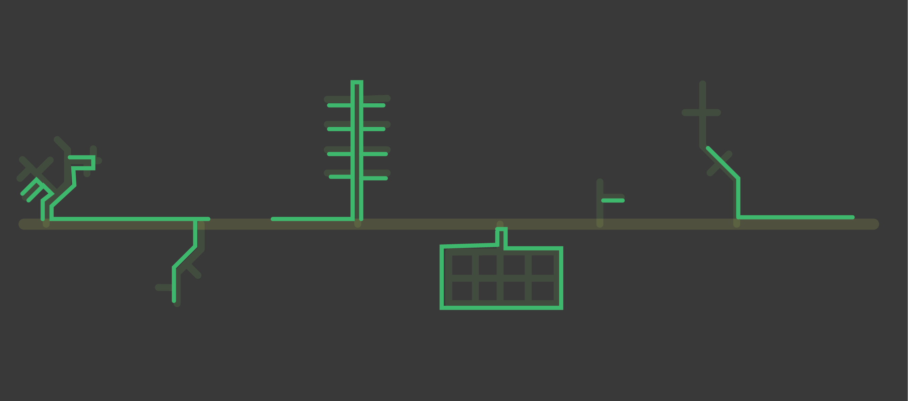
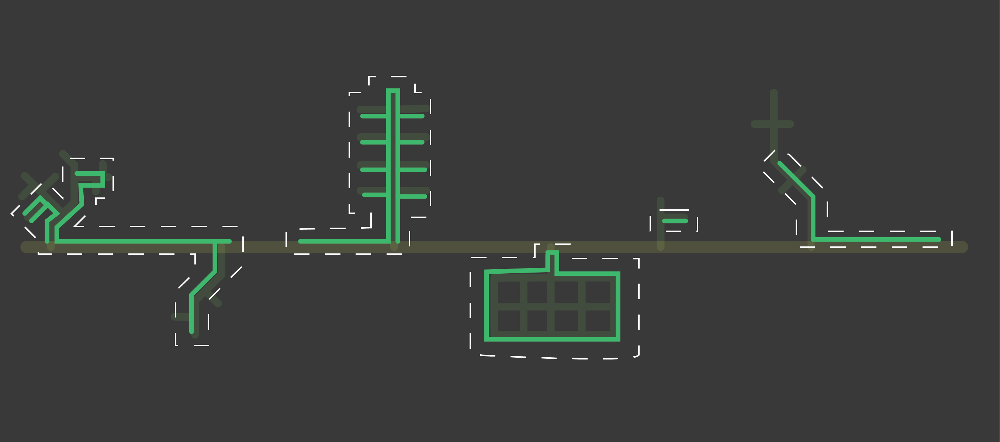
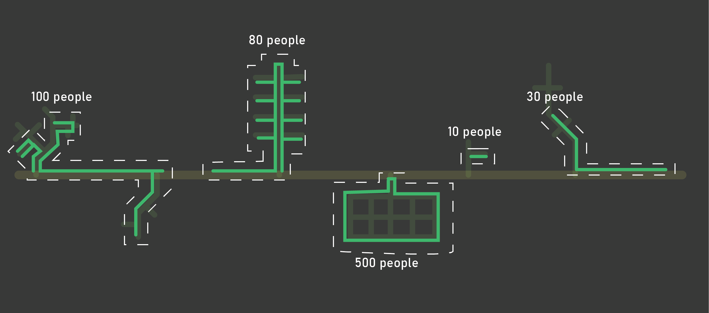
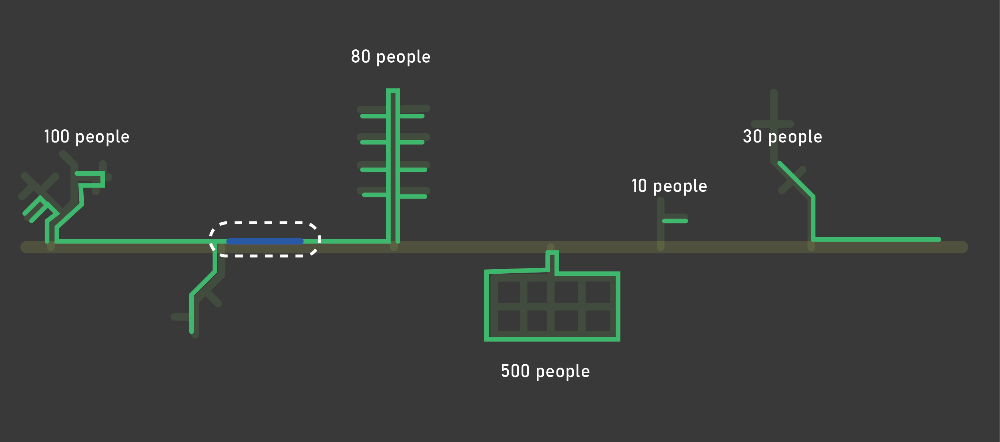
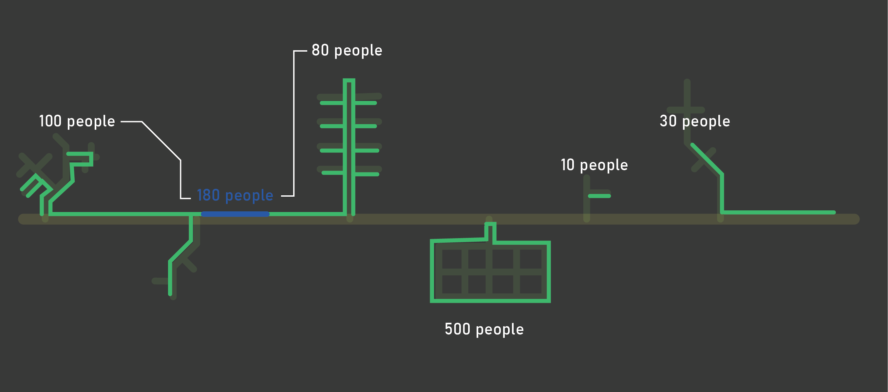
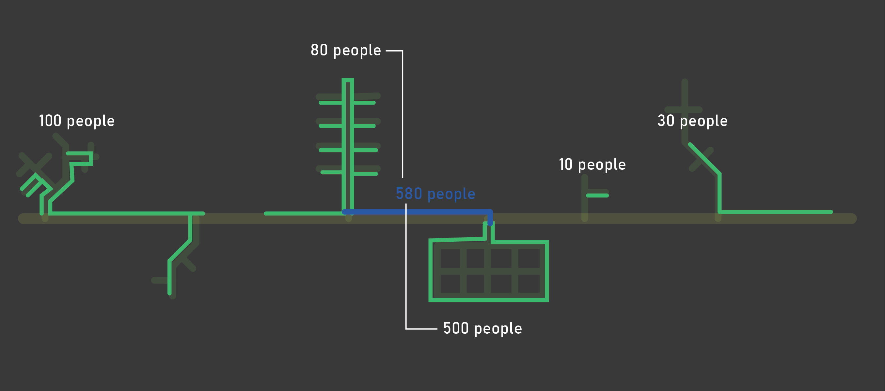
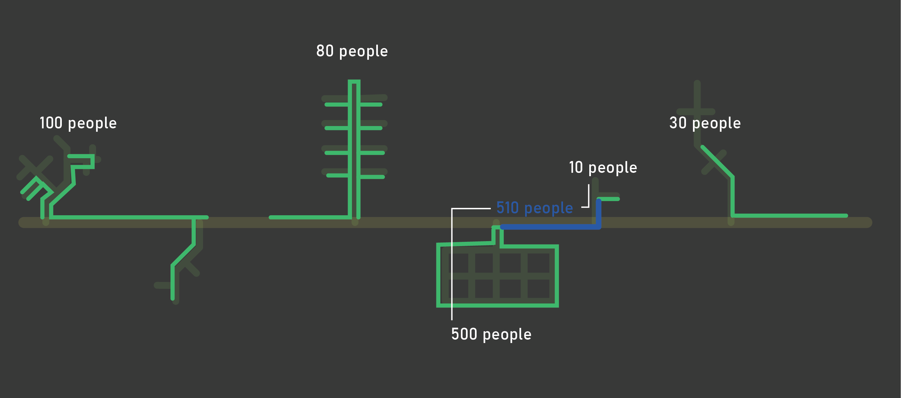
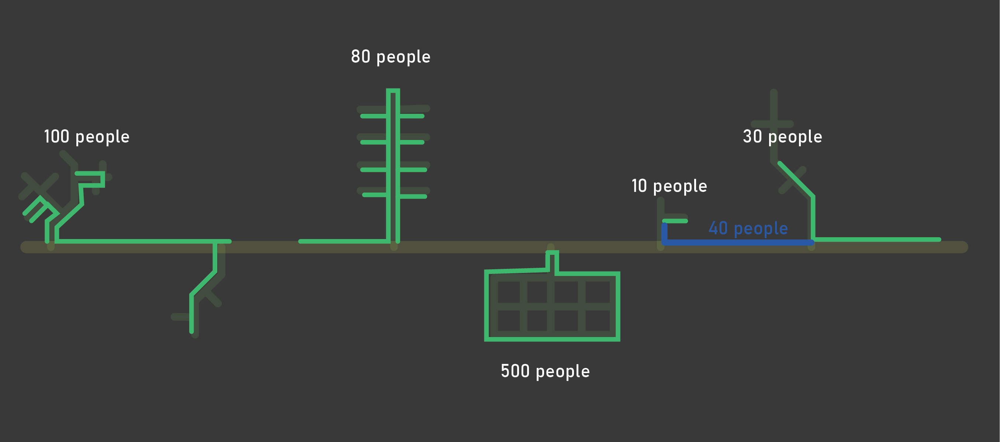
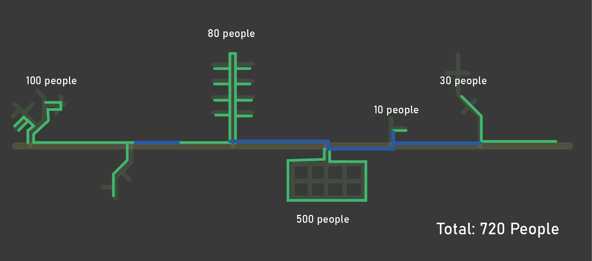

The process applied to the LTS network can also be aplied to sidewalks, with some differences.

Rather than using LTS, islands on the pedestrian network are simply defined as places with sidewalks and marked crosswalks. 

This example uses the same street, with only the pedestrian network visible. This location has a series of 
sidewalks and a marked crosswalk (on the left-most island, crossing our arterial road).

Islands are defined as places where there are sidewalks or marked crosswalks that are not connected to other sidewalks or marked crosswalks.

Census data estimates are collected for each island.

If a new segment is drawn to connect the two islands on the left, the number of people, jobs, etc... that would be connected can be evaluated. 

In this example, this new segment would connect approximately 180 people. 

The middle segment would connect 580 people. 

This segment would connect 510 people. Note that 500 of these people are also connected in the previous example.

The final segment would connect 40 people. 

If all of these segments were combined in the tool (see Drawing Multiple Segments), 720 people would be connected. 
If left uncombined in the tool and analyzed, each discrete segment would be summed, which is useful for prioritization, but should not be used to aggregate, or it will include double counting.  

In short, combining segments is used for total project benefit, while running them individually is useful for prioritization. 
